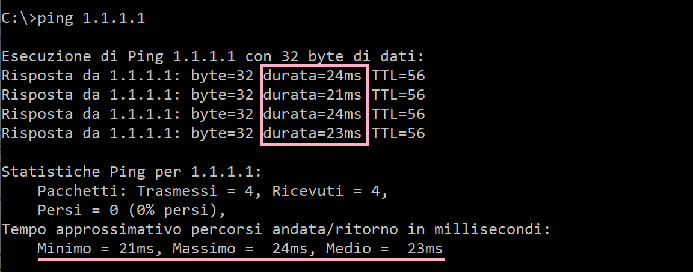

====
ping
====

.. note::

    Prerequisti: **Windows, command prompt**
    
    Argomenti trattati: **Indirizzamento IP**
      
    
.. Qui inizia il testo dell'esperienza

ping è un software di diagnostica di rete, implementato in tutti i sistemi operativi, che misura il tempo (in millisecondi) impiegato 
da uno o più pacchetti ICMP a raggiungere un altro dispositivo di rete e tornare indietro.

Tecnicamente ping invia un pacchetto ICMP di echo request e rimane in attesa di un pacchetto ICMP di echo response in risposta. Solitamente infatti la parte di OS dedicata alla gestione delle reti (stack di rete) è impostata per rispondere automaticamente con un pacchetto echo response alla ricezione di un pacchetto di echo request.

Il comando ping su Windows è impostato per inviare 4 pacchetti ICMP, attendere 4 risposte e poi calcolare le statistiche di ricezione e velocità.
La sintassi del comando ping è la seguente:

.. code-block:: bash

    $ ping [opzioni] host

Evitiamo di addentrarci nel discorso delle opzioni del comando ping e vediamo semplicemente il funzionamento e l'utilità dello stesso.

Come si vede, basta scegliere un target host (tramite IP o hostname) e lanciare il comando. Al termine dell'esecuzione bisogna osservare i pacchetti ritornati e
le statistiche di viaggio degli stessi per valutare la salute e le performance della rete stessa.

.. warning::

    Il comando ping su Windows è impostato automaticamente ad interrompersi dopo l'invio di 4 pacchetti.
    
    In ambienti Linux o Mac invece, il comando ping continua indefinitamente ad inviare pacchetti finché non
    lo si interrompe con un comando **CTRL + C** (mela + C su Mac). Quando viene interrotto l'invio vengono 
    generate le statistiche.
    

Il comando ping insieme ai comandi ipconfig e traceroute sono un ottimo strumento di diagnostica e sono semplicissimi da utilizzare. 
L'importante è ragionare sui risultati che si ottengono e formulare deduzioni appropriate. 

Ping test #1
============

Nel primo test, valutiamo la connettività della nostra rete. Controllando (con ipconfig/ifconfig/ip a seconda del sistema) abbiamo visto che il nostro
IP è 192.168.0.7 e che il nostro gatweway è 192.168.0.1.

I test da eseguire sono nell'ordine i seguenti

.. code-block:: bash

    # ping al nostro indirizzo
    # se risponde significa che la scheda è attiva e funzionante
    $ ping 192.168.0.7
    
    # ping al nostro gatweway
    # se risponde significa che la nostra rete è attiva e funzionante
    $ ping 192.168.0.1
    
    # ping ad un IP esterno
    # se risponde significa che abbiamo connettività Internet
    $ ping 1.1.1.1
    
    # ping ad un host
    # se risponde significa che anche la risoluzione DNS funziona!
    $ ping google.it
    
Se tutti questi test hanno funzionato correttamente, potete stare certi che il vostro dispositivo è ben connesso alla rete Internet.
In caso negativo, valutando quale test fallisce potete in maniera semplice individuare il problema.

Ping test #2
============

Nel secondo test valutiamo la velocità dei server DNS che stiamo utilizzando. Si tratta di risolvere un host tramite una risoluzione DNS
manuale e poi valutare la differenza di prestazioni fra il ping con hostname e il ping con IP.

.. code-block:: bash

    # risoluzione
    $ nslookup example.com
    1.2.3.4
    
    # ping HOSTNAME
    $ ping example.com
    ...
    
    # ping IP
    $ ping 1.2.3.4
    ...
    
Ovviamente questo test è molto empirico e non sempre funziona poiché non tutti i dispositivi rispondono ai ping :(

Ping test #3
============

Nel terzo test cercheremo di valutare la velocità della propria rete. L'idea di base è questa. Si scelgono 3 siti a caso 
(ad esempio: youtube.com, quotidiani.net, autoscout24.it) e si fanno i ping ad ognuno di essi. Si osservano i valori scegliendo il
più alto riportato nei tre test e si valuta la rete secondo la seguente tabella: 

============== =============
ping time (ms) velocità rete
-------------- -------------
 0 - 20        Ottima
20 - 40        Buona
40 - 60        Discreta
60 - 80        Sufficiente
oltre 80       ...
============== =============

.. warning::
    Questa tabella e questo modo di valutare la velocità di una rete hanno pochissime basi scientifiche e sono solo una stima
    di massima che io di solito faccio per valutare una rete.
    
    La velocità della rete dipende da moltissimi fattori, tra cui: i siti che visitate, l'orario di utilizzo, l'hardware a disposizione,
    la connessione wifi vs cablata, etc...
    
