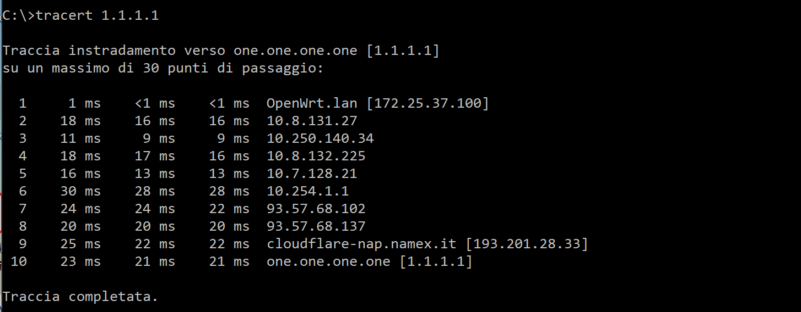
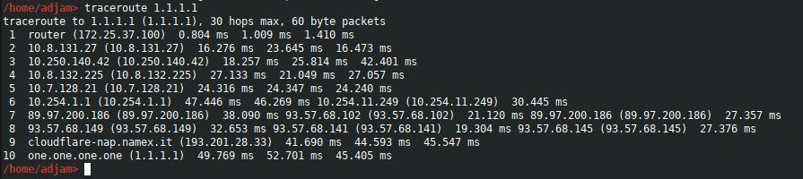

==========
traceroute
==========

.. note::

    Prerequisti: **Windows: command prompt. Linux, Mac: terminale**
    
    Argomenti trattati: **Protocolli IP, ICMP. Routing**
      
    
.. Qui inizia il testo dell'esperienza

Prima d tutto chiariamoci su una importante banalità: il comando che esegue l'operazione di *tracerouting* ha un nome diverso su Window, su Linux, su Mac.
Su Linux e Mac troviamo l'implementazione originale del tool di rete, che si chiama come l'operazione che esegue: **traceroute**.

Su Windows è stato progettato un nuovo tool, che si chiama **tracert**, fa esattamente la stessa cosa del precedente, con una interfaccia testuale sicuramente 
più carina e ordinata, al prezzo di ben tre ordini di grandezza (millisecondi contro microsecondi) e di una divergenza dallo standard che depone una volta di più
sulla simpatica politica dell'azienda con le finestre.

Allego 2 screenshot (il primo su Windows, il secondo su Linux, su Mac è uguale a Linux) dell'esecuzione di un traceroute verso il target **1.1.1.1** (scelto solo
per la sua semplicità numerica).

Il traceroute utilizza i pacchetti ICMP di tipo, appunto, *traceroute* per determinare i nodi di rete che il pacchetto attraversa. E verificare dunque i salti che
il pacchetto compie per andare dal punto A al punto B.

Immagine dell'esecuzione di **tracert su Windows**.

Immagine dell'esecuzione di **traceroute su Linux o Mac**.

Analizzate i risultati ottenuti per comprendere al meglio il processo di routing dei pacchetti.
