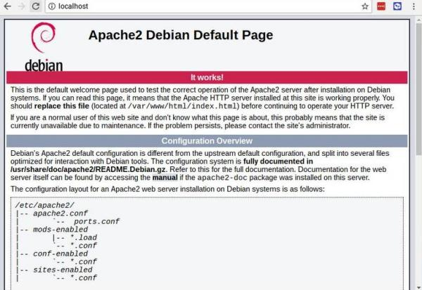

=====================
Sito web su Raspberry
=====================

.. note::

    Prerequisti: **Linux: terminale**
    
    Argomenti trattati: **HTTP, URL**
    
    Linguaggi per il web introdotti: **HTML, CSS, PHP**

    
    
.. Qui inizia il testo dell'esperienza

Il nostro obiettivo è installare un server web su Raspberry. La scelta del software ricadrà ovviamente su Apache (https://www.apache.org).

Apache è il server web più famoso e utilizzato nel mondo. Si è sviluppato e migliorato assieme al protocollo HTTP e la sua struttura modulare
gli permette di interagire anche con linguaggi di programmazione web lato server, come PHP, Perl, CGI o Python, per servire pagine dinamiche,
oppure di implementare nuove specifiche opzionali, come il supporto per HTTP 2.0.

Per installare Apache, dobbiamo accedere ad un terminale e, dopo aver verificato che il sistema sia aggiornato, installare il software:

.. code-block:: bash

    $ sudo apt install apache2

    
Questa semplice istruzione si occupa di tutto, ovvero:

* scarica il pacchetto software contenente il web server Apache dalla Rete

* lo installa

* abilita il servizio Apache per l'attivazione

* attiva il servizio Apache

Terminata l'esecuzione della linea di codice, si può procedere direttamente a testare il webserver! Per collegarsi ad esso, ci basta aprire il
sito **http://localhost/** e vedere la pagina iniziale!

Questo significa che l'installazione è andata a buon fine! ;)

Per permettere a chiunque altro di vedere la nostra pagina possiamo utilizzare due strategie:

Utilizzando l'indirizzo IP
    Questa opzione è la migliore nel senso che funzionerà con tutti i dispositivi che possono connettersi al proprio Raspberry. Dovete controllare l'indirizzo IP
    del Raspberry tramite il comando **ip addr** oppure tramite il comando **ifconfig** e poi far connettere chiunque a **http://X.X.X.X/** dove (ovviamente)
    X.X.X.X è l'indirizzo IP del Raspberry.
    
Utilizzando l'hostname del Raspberry
    Questa opzione è la più semplice, ma può funzionare solo se il nome è registrato in un servizio DNS a cui entrambi i dispositivi (il Raspberry e il
    PC o il telefono da cui guardare il sito web). Si può controllare l'hostname del Raspberry (se non lo ricordate) tramite il comando **hostname -I**
    

Modificare il sito web
======================

I file che rappresentano il sito web esposto tramite Apache si trovano in una cartella (e fino a qui...). La cartella in questione è la cartella

``/var/www/html``

quindi per accedervi e controllarne il contenuto dovete digitare:

.. code-block:: bash

    $ cd /var/www/html
    $ ls -al

Questo comando vi mostrerà, oltre che all'elenco dei file, informazioni su di essi come il proprietario, la dimensione, etc... Una roba tipo questa:

.. code-block:: bash

    total 12
    drwxr-xr-x  2 root root 4096 Jan  8 01:29 .
    drwxr-xr-x  3 root root 4096 Jan  8 01:28 ..
    -rw-r--r--  1 root root  177 Jan  8 01:29 index.html

In particolare vorrei farvi notare che il proprietario dei file del sito e della cartella che lo contiene è il Signore Onnipotente: **root**!
Questo significa che ogni operazione di modifica, cancellazione o aggiunta file dovrebbe essere fatta con sudo... Moooooolto noioso!

Cambiamo il proprietario della cartella:

.. code-block:: bash

    $ sudo chown pi /var/www/html -R
    
Adesso potete aprire i file e lavorare sulla cartella del sito anche con i programmi grafici :)

Installare PHP
==============

PHP è un linguaggio di programmazione web lato server; il suo nome è uno di quegi acronimi ricorsivi che tanto piacciono agli informatici.
PHP infatti sta per **Php: Hypertext Preprocessor**, richiamando il nome PHP.

Esso è un *preprocessore*: è codice che viene eseguito quando il server web riceve una richiesta per una pagina web. La pagina richiesta è dunque *il programma*
che viene eseguito al momento della richiesta. L'esecuzione di quel codice crea dunque una pagina HTML *al volo*, una **pagina dinamica**, che sarà poi
rinviata all'utente tramite il server web.

PHP è il linguaggio di programmazione web lato server più famoso: Facebook, Twitter e Wikipedia sono interamente scritti in PHP 
(e già questi esempi bastano... mi pare).

Per installare PHP è sufficiente scrivere i seguenti comandi:

.. code-block:: bash

    $ sudo apt install php
    $ sudo systemctl restart apache2
    
Per testare se tutto ha funzionato, basta scrivere una pagina, ad esempio **test.php** da salvare nella cartella principale del sito e scrivere il seguente codice:

.. code-block:: php

    <?php
    echo "<h1>Ciao</h1>";
    echo "Sono la tua prima pagina in PHP :)";
    ?>

Ovviamente, per vedere il risultato, bisogna puntare il browser su **http://localhost/test.php**

