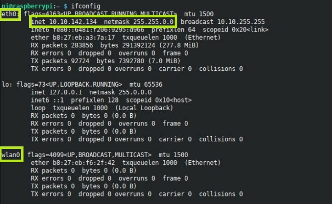

======================
Access Point Fai da te
======================

.. note::

    Prerequisti: **Raspberry, terminale linux**
    
    Argomenti trattati: **DHCP, DNS, Indirizzamento IP**
      
    
.. Qui inizia il testo dell'esperienza

L'idea è quella di implementare un Access Point WIFI analogo a quelli che si hanno a casa per la connessione, con server DHCP e server DNS
configurati manualmente.

Prima di andare avanti, ricordiamoci di aggiornare il sistema, ripulire e riavviare.

.. code-block:: bash

    $ sudo apt update
    $ sudo apt upgrade
    $ sudo apt autoremove
    $ sudo reboot

Scegliere un piano di indirizzamento
====================================

Da quello che abbiamo studiato sappiamo che ogni scheda di rete ha il suo indirizzo IP. Nel nostro Raspberry
ci sono 2 schede di rete:

#. la schede di rete cablata, che si chiama `eth0`
#. la scheda di rete wifi, che si chiama `wlan0`

La scheda di rete cablata dovrebbe essere collegata alla rete della scuola, quindi ha già un indirizzo IP fornito dai 
server DHCP della scuola.
La scheda di rete wifi non dovrebbe essere collegata a nulla e quindi non avere alcun indirizzo.

Per verificare i nomi delle schede di rete e l'indirizzamento attuale del nostro Raspberry procediamo da terminale con
il comando `ifconfig` (Valido anche da terminale Mac e analogo del comando ipconfig di Windows).

Si dovrebbe vedere qualcosa di simile a questo:

L'indirizzo IP della scheda WIFI dovrà essere statico e scelto da noi. Per il mio esempio e come riferimento in quello che scriverò dopo, io scelgo l'indirizzo 192.168.0.1/24.

A questo punto, immaginando che collegherò il server DHCP all'interfaccia `wlan0` dovrò scegliere uno scope e identificare tutte le informazioni
da passare ai client DHCP.

Io ho scelto le seguenti:

#. scope: 192.168.0.11-30 con TTL di 1 ora
#. gateway sarà ovviamente l'IP del Raspberry: 192.168.0.1
#. DNS sarà ancora una volta il Raspberry.

Ultima cosa, poiché si va ad implementare una rete wifi con password, bisogna scegliere il nome della rete Wifi (che si definisce SSID) e la chiave di accesso (la `password` del wifi).

Tenendo bene a mente (no, meglio se segnate su un foglio) le precedenti informazioni, possiamo procedere nell'implementazione del router/AccessPoint con Raspberry.

Installare e configurare dnsmasq
================================

L'installazione è facile:

.. code-block:: bash

    $ sudo apt install dnsmasq
    
Il file di configurare da modificare è il seguente

.. code-block:: bash

    $ sudo nano /etc/dnsmasq.d/dnsmasq.conf

Va impostato in questo modo, trovando le sezioni opportune:

.. code-block:: bash

    # to activate dhcp server on 1 interface
    interface=wlan0
    bind-interfaces 

    # scope
    dhcp-range=192.168.0.11,192.168.0.30,255.255.255.0,1h

    # options
    dhcp-option=option:router,192.168.0.1

    # dns configuration
    listen-address=192.168.0.1
    server=1.1.1.1
    domain-needed
    bogus-priv

    

Installare hostapd
==================

Qui l'installazione è più complicata :)

.. code-block:: bash
    
    $ sudo apt install hostapd
    $ sudo systemctl unmask hostapd
    $ sudo systemctl stop hostapd

Il file di configurazione va inserito nel percorso `/etc/hostapd/hostapd.conf`, quindi con il comando:

.. code-block:: bash
    
    $ sudo nano /etc/hostapd/hostapd.conf

Va copiato dentro pari pari il seguente codice, modificando opportunamente l'SSID scelto e la chiave di accesso:

.. code-block:: bash

    interface=wlan0
    driver=nl80211
    ssid=NOMESSIDSCELTO
    hw_mode=g
    channel=2
    ieee80211n=1
    wmm_enabled=1
    macaddr_acl=0
    auth_algs=1
    ignore_broadcast_ssid=0
    wpa=2
    wpa_key_mgmt=WPA-PSK
    wpa_passphrase=PASSWORDWIFIALMENO8CARATTERI
    rsn_pairwise=CCMP

Fai in modo che il file di configurazione venga caricato dal demone hostapd: apri `/etc/default/hostapd` e modificalo come indicato

.. code-block:: bash

    $ sudo nano /etc/default/hostapd

Va modificata un'unica riga, in corrispondenza della voce DAEMON_CONF che va decommentata e riempita come indicato.

.. code-block:: bash

    DAEMON_CONF="/etc/hostapd/hostapd.conf"

Ok, siamo pronti!

Ultime impostazioni
===================

Le ultime operazioni da fare servono per far funzionare il Raspberry come un router e permettergli dunque di condividere la sua connettività con 
tutti quelli connessi al suo Wifi tramite hostapd. Sono operazioni standard che vanno eseguite una ad una nella riga di comando.

Le divido blocco per blocco per evidenziare i vari passaggi.

Impostazione IP statico rete Wifi

.. code-block:: bash

    $ sudo ip link set wlan0 up
    $ sudo ip addr add 192.168.0.1/24 dev wlan0
    
Abilitazione traffico di rete attraverso il Raspberry

.. code-block:: bash

    $ sudo sysctl -w net.ipv4.ip_forward=1
    $ sudo iptables -t nat -A POSTROUTING -o eth0 -j MASQUERADE
    $ sudo iptables -A FORWARD -i eth0 -o wlan0 -m state --state RELATED,ESTABLISHED -j ACCEPT
    $ sudo iptables -A FORWARD -i wlan0 -o eth0 -j ACCEPT

Ultimo, se non ci sono messaggi di errori precedenti, avviare hostapd e dnsmasq.

.. code-block:: bash

    $ sudo systemctl start hostapd
    $ sudo systemctl start dnsmasq
    
Ecco fatto, dovrebbe funzionare tutto! 

Prendete il vostro telefono e provate a connettervi alla rete Wifi del Raspberry e a navigare!

