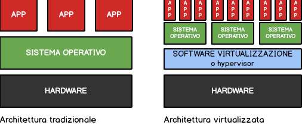

==========
VirtualBox
==========
    
    
.. Qui inizia il testo dell'esperienza

Macchine virtuali
=================

Senza pietà, rivedo e correggo la prima frase di Wikipedia sull'argomento. 

In informatica il termine **macchina virtuale (VM)** indica un software che, attraverso un processo di virtualizzazione, crea un ambiente virtuale 
che emula tipicamente il comportamento di una macchina fisica grazie all'assegnazione di risorse hardware (porzioni di disco rigido, RAM e risorse di processamento) 
ed in cui le applicazioni possono essere eseguite come se interagissero con tale macchina.

In pratica stiamo parlando di un software in grado di emulare diversi tipi di hardware, per realizzare tutto il necessario per eseguire *virtualmente* un altro sistema
operativo, da cui il termine *Macchina Virtuale*.

Il sistema operativo fisico su cui viene installato l'emulatore si definisce **Sistema Host**. Il sistema operativo che si installa sull'hardware virtuale viene definito
**Sistema Guest**. A parte il nome e le prestazioni in presenza (chiaramente i sistemi fisici sono più veloci) a livello di rete o a livello remoto sistemi operativi fisici 
e virtuali sono spesso indistinguibili e assolutamente intercambiabili.

.. warning::
    Virtualizzare una intera macchina fisica non è un gioco da ragazzi per un hardware! Questa capacità risiede in una opzione del vostro processore che va assolutamente abilitata
    tramite BIOS. 
    
    Per processori Intel questa caratteristica si chiama **Intel Virtualization Technology (Intel VT)**. Per processori AMD si chiama **AMD Virtualization (AMD V)**.
    
    Se siete fortunati sono già abilitate nel vostro hardware. Altrimenti bisogna accedere al BIOS e provvedere da sè.

VirtualBox
==========

Fra le varie soluzioni software per la virtualizzazione, la mia selezione didattica considera sempre e solo le soluzioni gratuite, opensource e multipiattaforma. Ecco perché 
la mia scelta ricade sull'utilizzo di **Oracle VM VirtualBox** (https://www.virtualbox.org). Questo software, oltre ad essere rilasciato con una licenza libera ed essere disponibile
su Windows, Mac, Linux ha anche altre 2 belle caratteristiche dalla sua parte: è probabilmente il software di virtualizzazione più semplice da utilizzare in assoluto e presenta
una eccellente interfaccia grafica, costruita con le librerie Qt.

Per l'installazione e la configurazione (semplicissime) dell'emulatore, aprite il sito web indicato sopra e seguite le istruzioni riportate sul suo manuale 
online: https://www.virtualbox.org/manual/ch01.html.

**Buon lavoro!**
