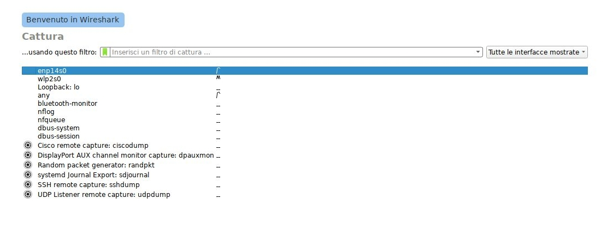
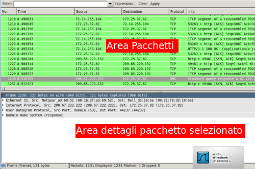

=========
Wireshark
=========

.. note::

    Prerequisti: **Windows**
    
    Argomenti trattati: **Protocolli di rete e di trasporto. Più tutto il resto**
      
    
.. Qui inizia il testo dell'esperienza

 
WireShark è un analizzatore di rete molto diffuso e molto potente, appartenente alla classe degli sniffer di rete. Usarlo tuttavia, almeno per operazioni di base o di studio del funzionamento della rete, è relativamente semplice.

Vedremo qui semplicemente una minima parte delle funzioni più importanti, come la cattura dei pacchetti, la selezione di questi ultimi per mezzo dei filtri e alcune funzioni che tornano comode soprattutto quando c'è una grossa mole di dati.

Per prima cosa occorre selezionare l'interfaccia di rete dalla quale si vogliono catturare i pacchetti in transito. Questa operazione attiverà la scheda in modalità “promiscua”, cioè la renderà capace di intercettare tutti i pacchetti in transito sulla rete e non solo quelli destinati all'host. 

Vediamo l'interfaccia principale di WireShark, cercando di capirne l'organizzazione:

Come si deve, il colpo d'occhio è chiaro e semplice: i pacchetti sniffati sono studiati ed elencati in ordine di cattura. Selezionandone uno si hanno tutte le informazioni relative.

Tra le *funzioni utili* di WireShark, elenchiamo le due più usate:

#. L'opzione **follow X Stream** dove X è uno tra TCP e UDP, permette di evidenziare il flusso di una comunicazione a cui il pacchetto selezionato appartiene. 
   In questo modo si esce dall'ordinamento classico “per cattura” e si ottiene una lista di tutti i pacchetti relativi ad una connessione.

#. L'opzione **filtra pacchetti** permette una selezione dei pacchetti interessanti secondo un modello prestabilito.

La sintassi dei filtri è analoga alle condizioni dei linguaggi di programmazione. Immaginiamo di voler vedere tutti i pacchetti diretti al dispositivo
con IP 1.2.3.4. Allora il filtro diventa:

.. code:: bash
    
    ip.addr == 10.2.4.200

Oppure, vogliamo visualizzare tutti i pacchetti del protocollo HTTP e DNS. I nomi dei protocolli funzionano come variabili booleane, le operazioni logiche
utilizzano la sintassi del linguaggio C ( && sta per AND, || sta per OR, ! sta per NOT), allora:

.. code:: bash
    
    http && dns

In ogni caso, ci sono 2 auti fondamentali che vengono da Wireshark per la compilazione dei filtri:

#. l'autocompletamento: il software suggerisce come completare il filtro che si inizia a scrivere

#. il colore di sfondo: la barra dei filtri diventa rossa mentre si scrive un filtro e passa al verde appena il filtro è sintatticamente corretto.

Usare WireShark
===============

Capisco che introdurre un software come WireShark ci dica tutto e niente delle sue potenzialità. Per capire davvero occorre provare!

Proviamo a fare allora dei semplici esercizi per capire il funzionamento del software.

#. Ricostruire una connessione HTTP (richiesta/risposta) elencando TUTTI i pacchetti inviati.

#. Filtrare tutti i pacchetti delle connessioni DNS, evidenziando i record presenti nei pacchetti.

#. Filtrare il traffico ARP, cercando di dedurre la struttura del protocollo stesso dall'osservazione dei suoi pacchetti.

#. Individuare un 3-way handshake TCP, valutando tempistiche e funzionamento tramite osservazione dei pacchetti.

 
