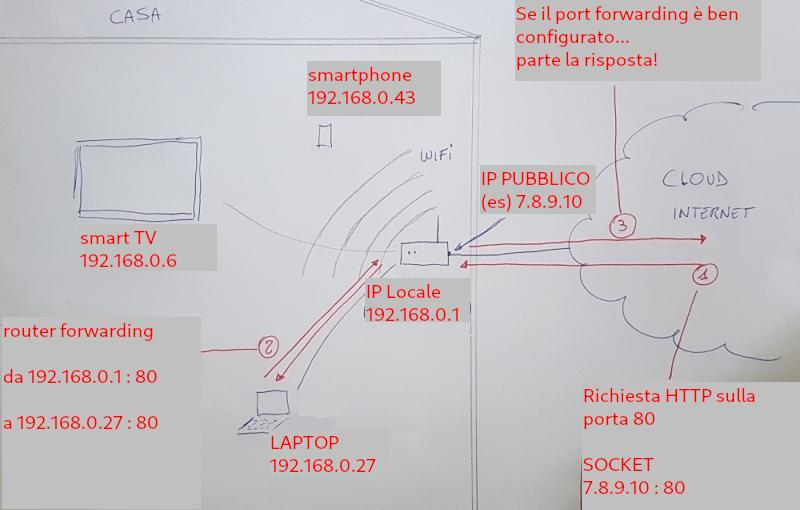
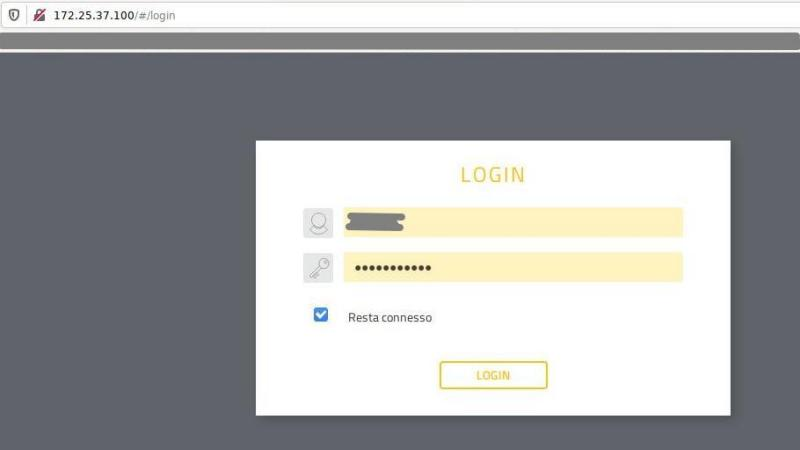
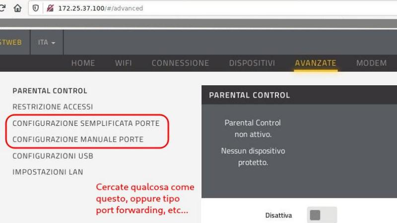

===============
Port Forwarding
===============

.. note::

    Prerequisti: **Browsing**
    
    Argomenti trattati: **Protocolli di trasporto**
      
    
.. Qui inizia il testo dell'esperienza

Il Port Forwarding è una abilità del livello di trasporto che permette di reindirizzare una connessione destinata ad un certo socket verso un altro socket,
quando questa attraversa un dispositivo di rete (un router o un firewall).
Esso è dunque una applicazione di NAT (Network Address Translation) poiché, spostando uno dei socket target della connessione rende possibile
modificare l'IP (ovvero il mittente, oppure il destinatario) della stessa.

L'idea di questa esercitazione, da fare a casa, è quella di rendere disponibile un servizio installato su un computer locale sulla rete internet, 
ridirigendo le richieste che arrivano al modem router di casa dalla linea esterna verso il dispositivo interno che esegue un servizio.

Nella seguente immagine ho cercato di descrivere il problema immaginando un generico server WEB disponibile sul LAPTOP sulla porta 80 e raggiungibile 
dall'esterno tramite l'indirizzo IP (pubblico) del router.

Qualche minuto di tempo per analizzare (e godere) del disegno...

Bene!

Per questa esperienza vi servono alcune informazioni relative alla rete di casa vostra. Un buon inizio sarebbe individuare:

- l'IP del vostro dispositivo (possibilmente un PC, oppure un Raspberry)

- l'IP del modem/router/access point di casa vostra

Non dovrebbe essere difficile desumerli osservando l'output del comando *ipconfig* (Windows) oppure *ifconfig* (Linux, Mac). 
L'IP del proprio dispositivo è quello indicato accanto alla scheda di rete; l'IP del proprio dispositivo di rete è solitamente il gatewar/server DHCP
che desumete dalle informazioni di rete.

Adesso dovete collegarvi al router di casa vostra. Di solito le informazioni di accesso (IP, user, pass) sono proprio sul router, su una etichetta o su una 
placchetta sul retro/fondo del dispositivo.

Collegatevi utilizzando il browser e digitando l'URL: **http://IP_del_router**. Ad esempio potrebbe essere qualcosa tipo *http://192.168.1.1*. A casa mia la rete
è un pò particolare :)

Adesso all'interno dell'interfaccia di configurazione del router dovete trovare qualcosa tipo **configurazione porte**, **port Forwarding**, **virtual server**, etc...

Da lì la configurazione è diversa per ogni router... posso aiutarvi poco :(

Quello che dovete fare è abbinare i due socket che devono comunicare (quello sul dispositivo e quello sul router). 

**IP del router : 80 -----> IP del PC/Raspberry : 80**

Ricordate che siete sull'interfaccia del router, quindi il suo IP è solitamente implicito. 
Resta da indicare la porta da ascoltare (nel nostro esempio la porta 80, HTTP) e il socket che la deve ricevere
(IP del dispositivo, il PC o il Raspberry, e ancora porta 80 oppure porta HTTP).

**Buona Fortuna!**

PS: fortuna, un corno! Dovete riuscirci...

PPS: quello che poi potete farci con il port Forwarding dipende dalle vostre conoscenze sul livello superiore!
